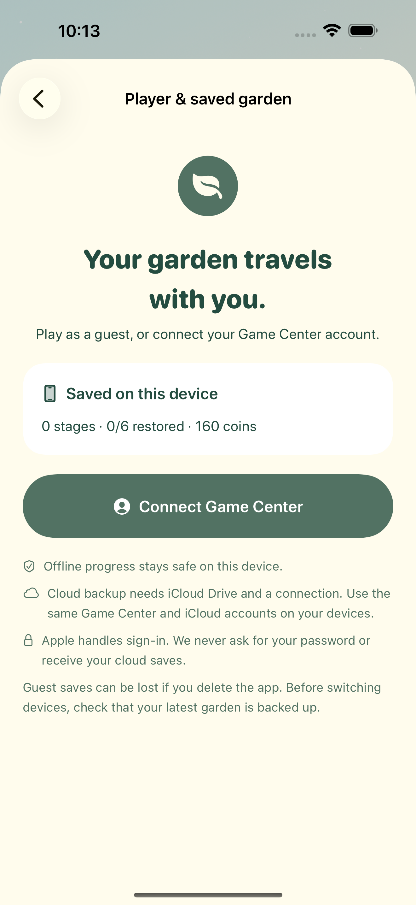

# Orbit Bloom release product page — build 7

The current Apple product page uses **twenty real native screenshots**, ten each for iPhone and iPad, plus new original botanical header/search artwork. [Current product-page bundle](product-page/README.md) shows the artwork, ordered galleries, Apple previews, source hashes and exact prompts. Puzzle, farm and race lead both galleries; field rewards, powers, restoration, supplies, saved-garden settings and iPad landscapes cover the other supported flows. No gameplay screenshots were synthesized or resized; source builds 6/7 are labeled accurately.

**Version 1.0 (7) and all six purchases are Waiting for Review**, resubmitted on 9 October 2026 at **10:55 PM India time**. [Apple confirmation](product-page/proof/apple-review-submission.jpg) records all seven items in submission `a7ca5b7d-24f9-4b4a-8dba-9ecf44398ec9`. The linked header and search assets also show Waiting for Review. [Upload status](app-store-screenshots.json), [Apple status](app-store-status.json), [metadata](metadata.json) and [preparation notes](../APP_STORE_PREPARATION.md) record the current package. Public release remains manual and requires Apple approval.

Build 7's 68 unique tests pass; the farm/reward and iPad swipe/layout flows passed again for this gallery update. App shipping code and the signed binary are unchanged. TestFlight build 7 is assigned to internal QA; the owner tester's last observed installation is build 6. Live cloud syncing and signed sandbox purchases remain hardware checks. The earlier 10:26 PM submission was cancelled by the publisher to unlock product artwork edits. The historical gallery below retains earlier capture evidence; current assets and proofs are in product-page/.

### Player and saved garden

### iPad player and saved garden

### World

### Botanical circuit

### Victory

### Farm

### Tool shed

### Race lobby

### Delivery race

### Chapter finale

### Complete world

### Delivery complete

### Bomb blast

### Lives and shop

### Coin packs

### Starter bundle

### Field tasks

### Board power

### Puzzle water survives reopening

Build 5: four collected dewdrops increase farm water from 12 to 16. After reopening, planting a rose spends two water.

### Locked island

### Power pattern journal

### iPad release captures

The former gallery used nine build 6 iPad captures: seven portraits and two landscapes, including the saved-garden page. The current gallery uses ten build 7 captures recorded in [product-page/manifest.json](product-page/manifest.json). Portraits are native 2064 × 2752; landscapes retain their original rotation metadata and display at 2752 × 2064. Apple's preview was checked visually for correct landscape orientation. [Store source manifest](build6/ipad/verification.json) and [fresh build 7 QA manifest](build7/verification.json) record dimensions, hashes and exact test attachments. The unchanged store gallery passed review validation with build 7.

### In-app purchase review

[Six actual pack screens](purchase-review/verification.json) and [review notes](purchase-review/metadata.json) were saved and verified after navigation/reload. All six Apple products were submitted together with version 1.0 (7) and show **Waiting for Review**. No product was purchased with real money.
