# Orbit Bloom release screenshot draft

Version 1.0, workspace build 5. Nineteen refreshed captures show the verified native game at **1320 × 2868**. They come from the final passing Store QA simulator run; none were resized or synthesized for uploads. The previous ten build 3 medium-display captures are archived in screenshots/archive-build3-medium/.

Ten current large-display screenshots are uploaded and retained after reload; the medium-display view inherits that set through Apple’s Using Existing Assets. The selected ten and their upload status are in [app-store-screenshots.json](app-store-screenshots.json). Device classes are tracked independently: large-display captures cannot substitute by claiming different pixel dimensions. [Verification manifest](verification.json) records **45 passing cases**, dimensions, hashes and source attachment names. Logs and result bundles remain local under evidence/.

[Metadata](metadata.json) and [App Store preparation](../APP_STORE_PREPARATION.md) track draft copy, hosting and signing. The gallery shows game scenes and bitmap board sprites; the island terrain uses actual SceneKit meshes.

### World

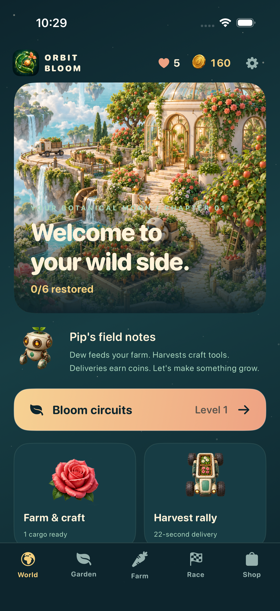

### Botanical circuit

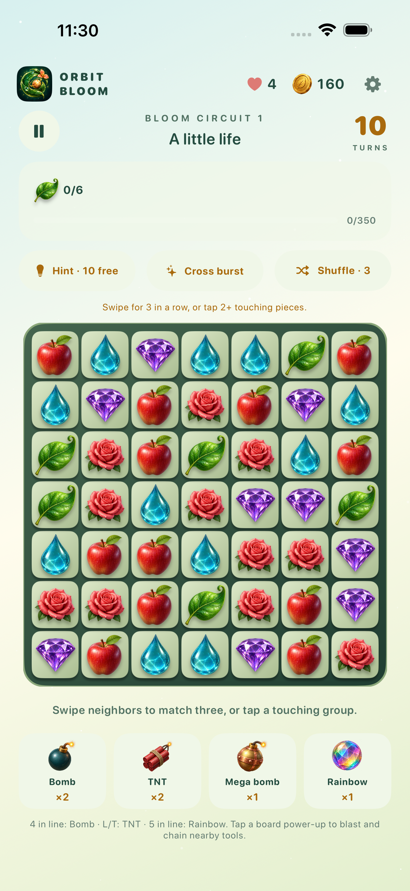

### Victory

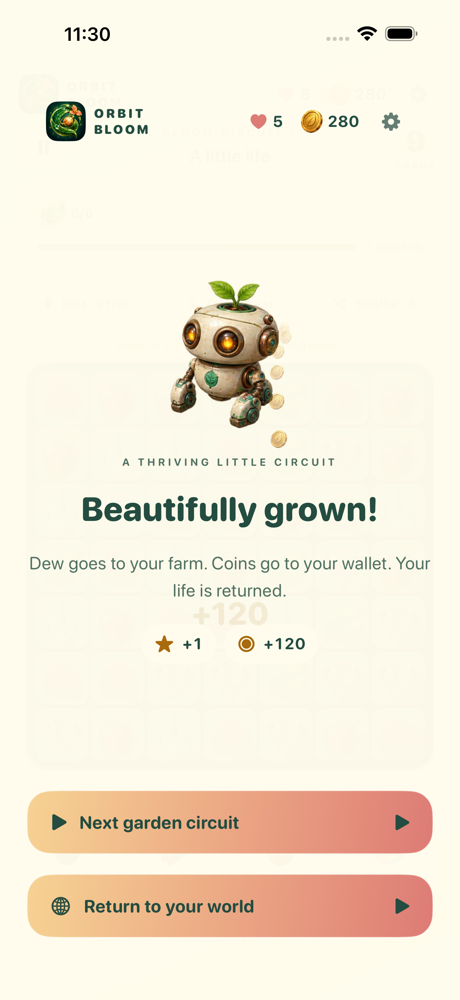

### Farm

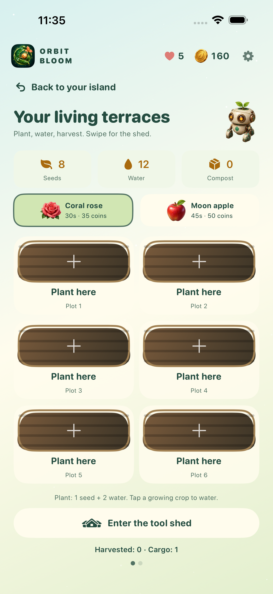

### Tool shed

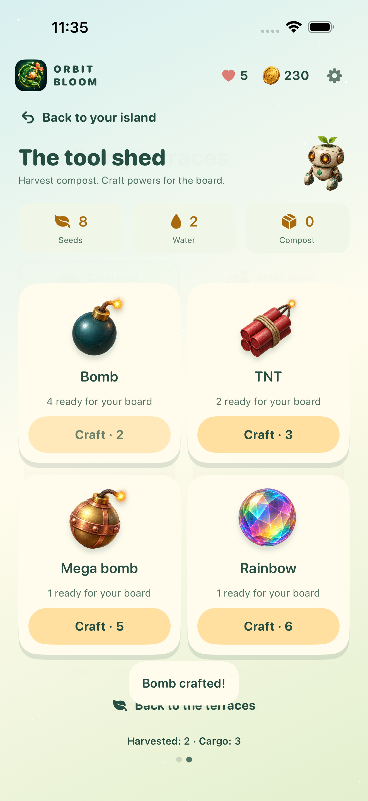

### Race lobby

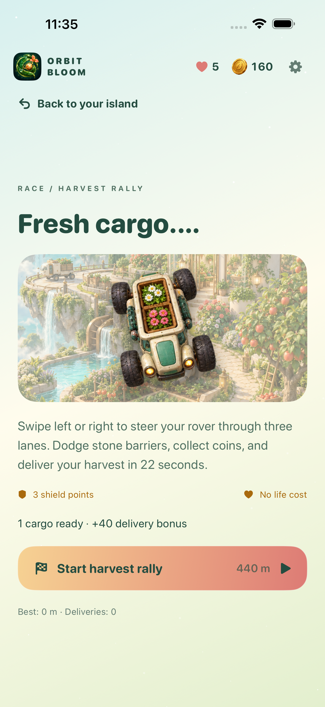

### Delivery race

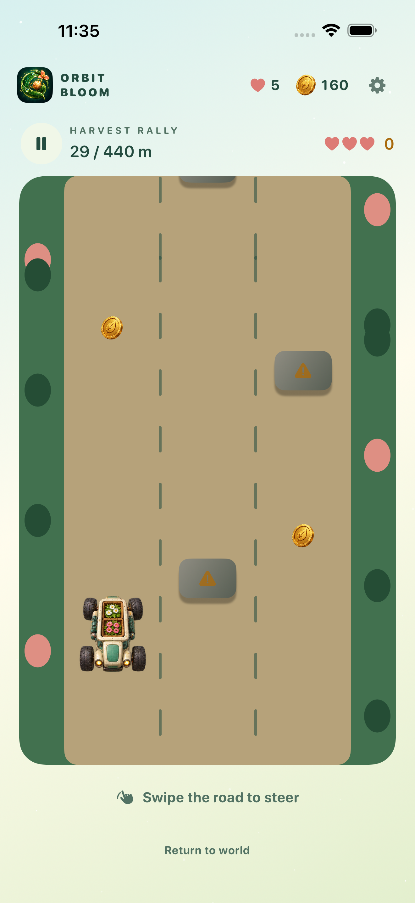

### Chapter finale

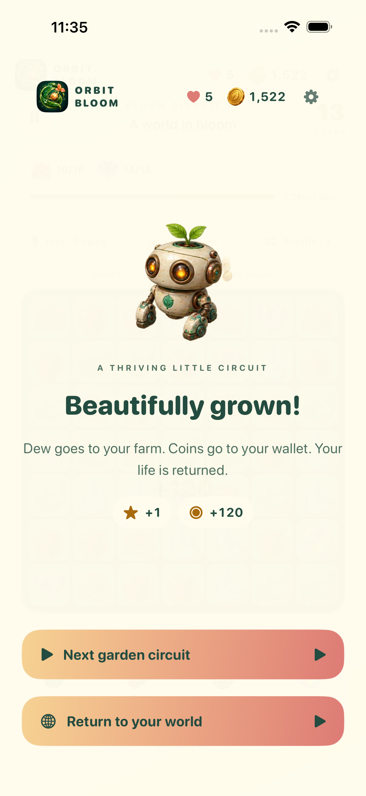

### Complete world

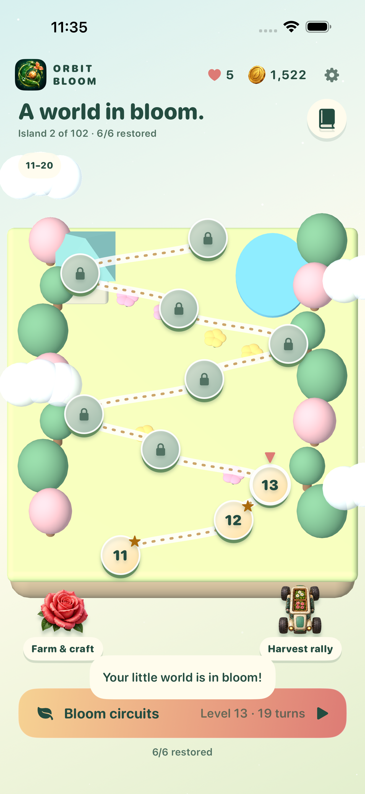

### Delivery complete

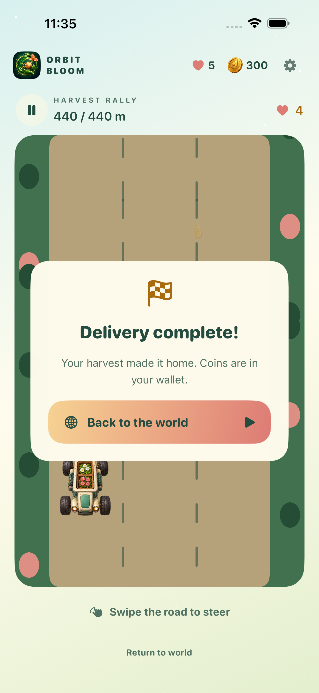

### Bomb blast

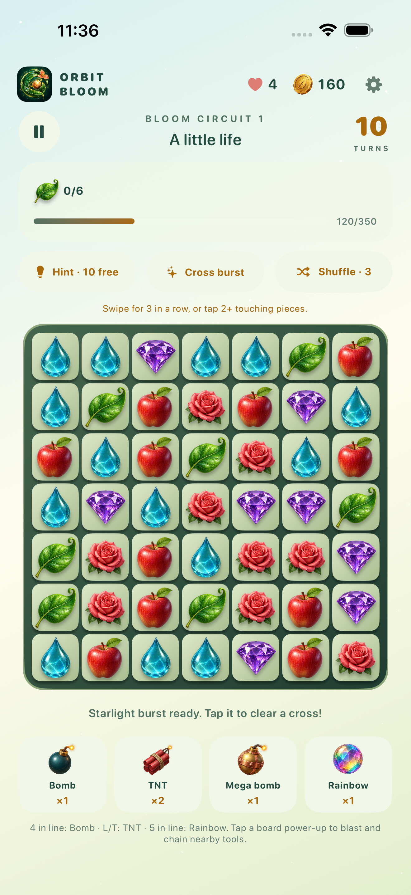

### Lives and shop

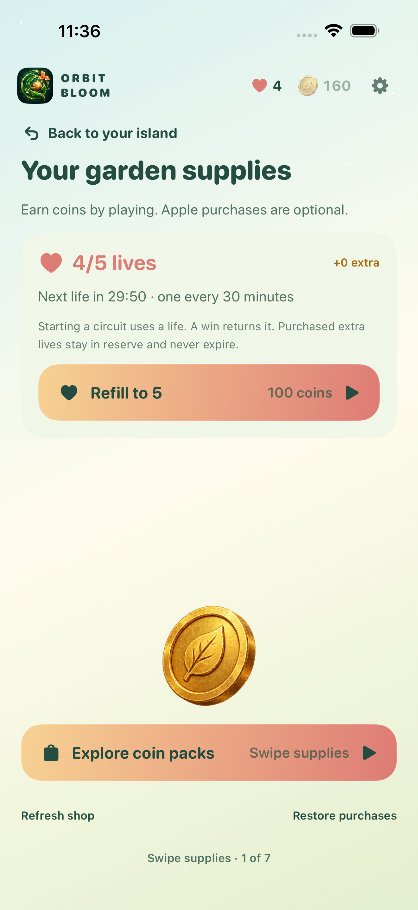

### Coin packs

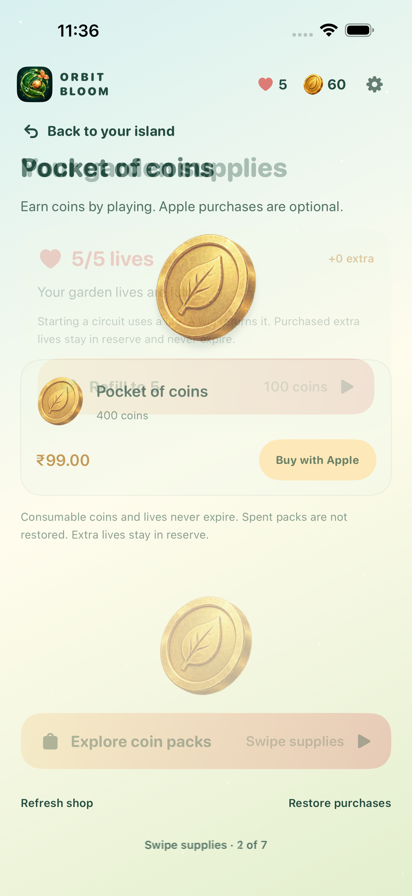

### Starter bundle

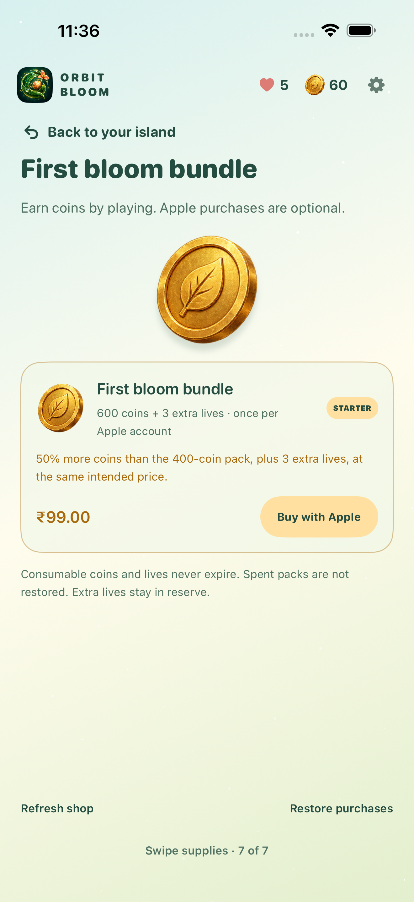

### Field tasks

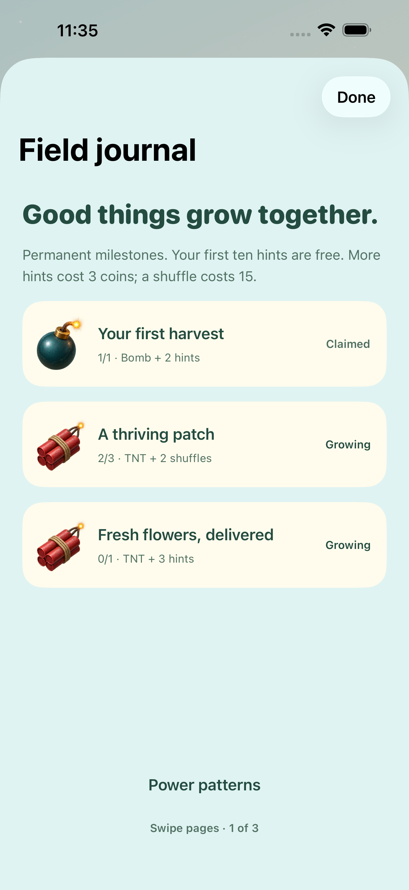

### Board power

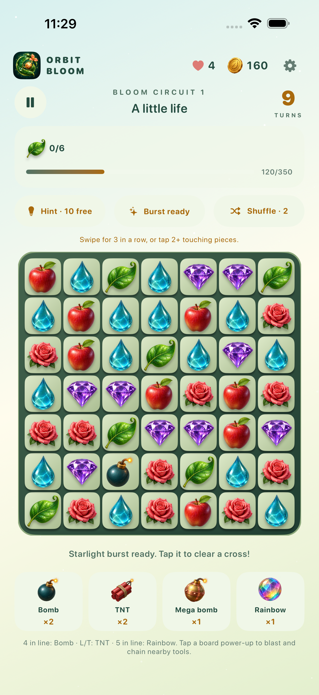

### Puzzle water survives reopening

Build 5: four collected dewdrops increase farm water from 12 to 16. After reopening, planting a rose spends two water.

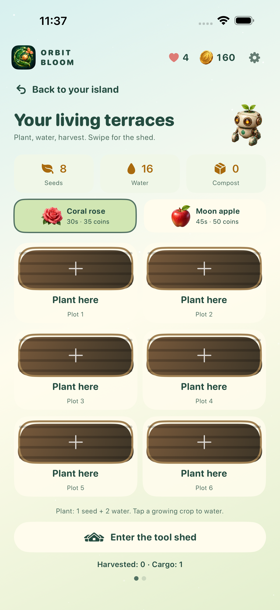

### Locked island

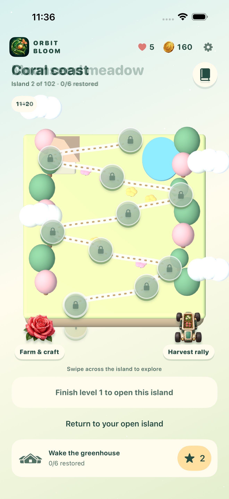

### Power pattern journal

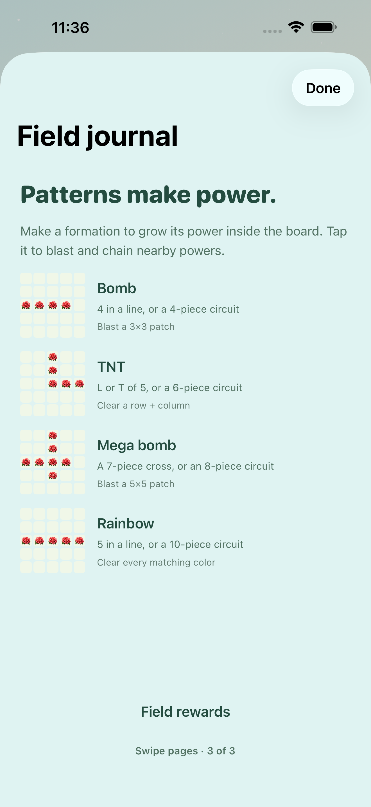
