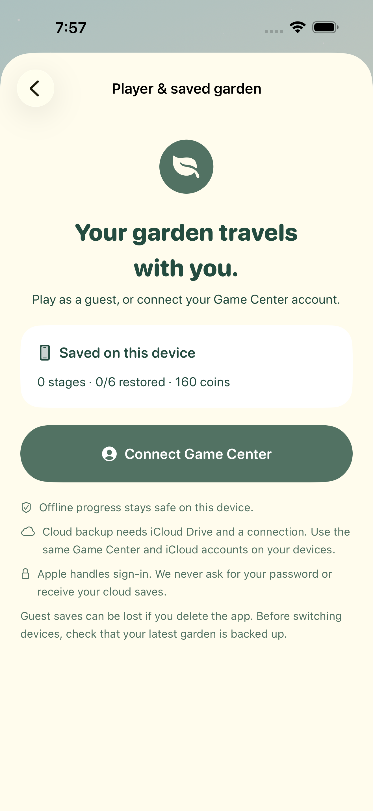
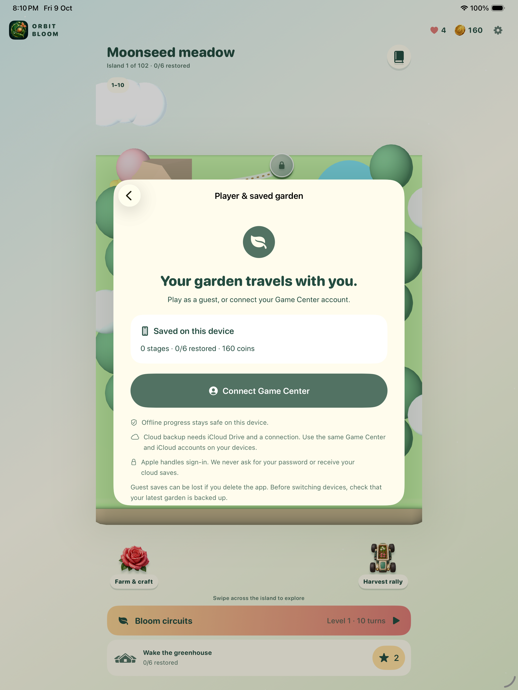

# Orbit Bloom release screenshots — build 6

Version 1.0, workspace build 6. [Thirty actual iPhone captures](build6/verification.json) and [nine iPad captures](build6/ipad/verification.json) come from passing native UI tests. The phone captures are 1320 × 2868, with seven iPad portraits at 2064 × 2752 and two landscape QA frames with original rotation metadata. No captures were resized or synthesized. **60 unique tests pass** across the recorded runs; live Apple cloud syncing remains a device check.

**Version 1.0 (6) and all six purchases are Waiting for Review**, submitted on 9 October 2026 at 8:42 PM India time. [Apple confirmation](build6/apple-review-submission.jpg) records all seven items. The store contains ten native iPhone screenshots and nine native iPad screenshots, including saved-garden pages and iPad landscapes. Interrupted iPhone uploads were repaired before Apple validation passed. [Upload status](app-store-screenshots.json), [Apple status](app-store-status.json), [metadata](metadata.json) and [preparation notes](../APP_STORE_PREPARATION.md) record the final package. Build 6 is processed in TestFlight and assigned to internal QA; accept the existing owner invitation to check live cloud saves and sandbox purchases on hardware. Public release remains manual. The gallery below includes unchanged build 5 gameplay views; current captures and hashes are in build6/.

### Player and saved garden

### iPad player and saved garden

### World

### Botanical circuit

### Victory

### Farm

### Tool shed

### Race lobby

### Delivery race

### Chapter finale

### Complete world

### Delivery complete

### Bomb blast

### Lives and shop

### Coin packs

### Starter bundle

### Field tasks

### Board power

### Puzzle water survives reopening

Build 5: four collected dewdrops increase farm water from 12 to 16. After reopening, planting a rose spends two water.

### Locked island

### Power pattern journal

### iPad release captures

The store now uses all nine refreshed build 6 iPad captures: seven portraits and two landscapes, including the saved-garden page. Portraits are native 2064 × 2752; landscapes retain their original rotation metadata and display at 2752 × 2064. Apple's preview was checked visually for correct landscape orientation. [Current iPad manifest](build6/ipad/verification.json) records dimensions, hashes and exact test attachments. The older six portrait captures and two landscape QA captures below remain historical build 5 evidence.

### In-app purchase review

[Six actual pack screens](purchase-review/verification.json) and [review notes](purchase-review/metadata.json) were saved and verified after navigation/reload. All six Apple products show Ready for Review in one iOS draft. The app version must join them before final submission. No product was purchased with real money or submitted for review.
