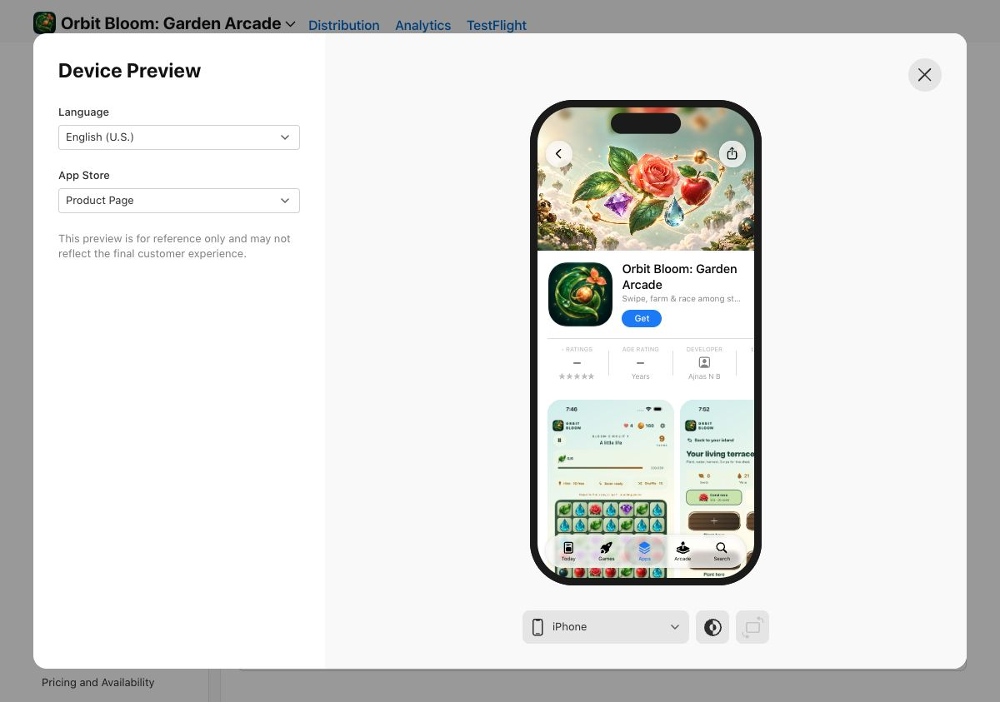
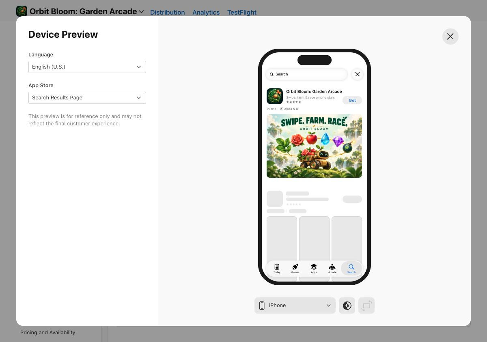
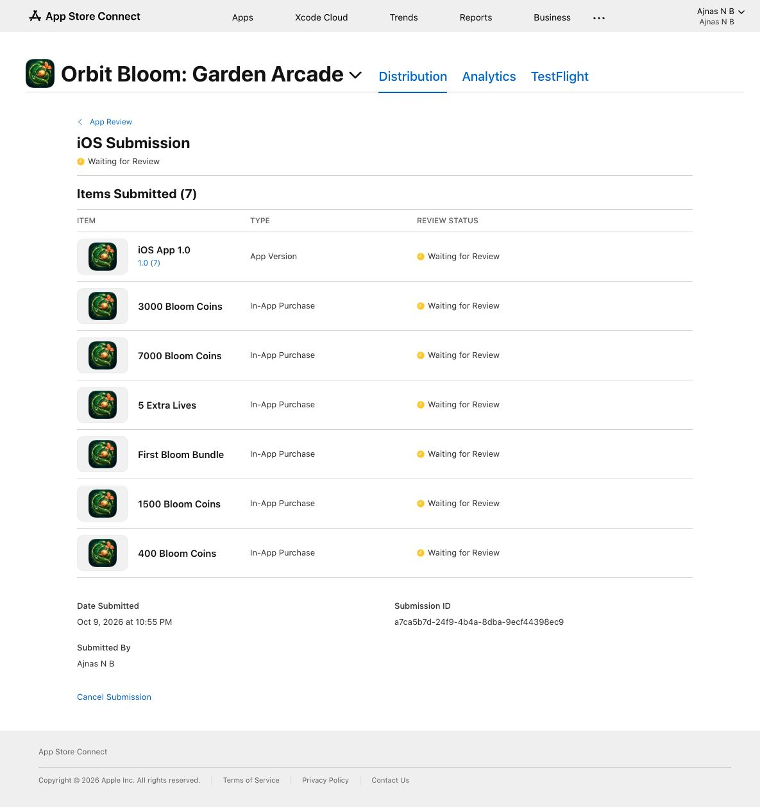

# Orbit Bloom — complete App Store product page

Version 1.0 (7), refreshed 9 October 2026. The product page, linked creative assets and all six purchase packs were resubmitted at **10:55 PM India time**. [Apple confirms Waiting for Review](proof/apple-review-submission.jpg), submission `a7ca5b7d-24f9-4b4a-8dba-9ecf44398ec9`. Public release is manual and remains pending Apple approval.

## Header and search artwork

Original dimensional botanical artwork uses the game's leaves, rose, apple, diamond, dewdrop and garden rover. Both images were generated using the built-in imagegen tool; [exact prompts and export provenance](IMAGE_PROMPTS.md) record the generation and technical upsampling. They are separate brand illustrations, not app screenshots.

| Placement | File | Upload pixels | Apple asset ID | Status |
| --- | --- | --- | --- | --- |
| Product header | [Header PNG](creative/orbit-bloom-header.png) | 3840 × 1646 | 08c00019-689f-87a9-803c-67de0c1e9279 | Waiting for Review |
| Search results | [Search PNG](creative/orbit-bloom-search.png) | 1920 × 1280 | f7800019-689f-87a9-802c-11f4d5819599 | Waiting for Review |

Both opaque images are attached to the default English (U.S.) product page and were visually checked in Apple's previews. Creative placements display on iOS/iPadOS 27 and later according to [Apple's guidance](https://developer.apple.com/help/app-store-connect/manage-app-information/manage-your-app-store-assets/); native screenshots cover earlier store versions.

## Twenty real native screenshots

The first three images show puzzle, farm and race. Both device galleries have all ten slots filled; the medium iPhone class inherits the large-display gallery. The iPad set contains eight portraits and two original landscapes. All uploads completed, persisted and passed submission validation. The replaced placements remain recoverable in Apple's Asset Library.

| Slot | iPhone | iPad |
| --- | --- | --- |
| 1 | [01-swipe-and-blast](iphone/01-swipe-and-blast.png) | [01-swipe-and-blast](ipad/01-swipe-and-blast.png) |
| 2 | [02-grow-your-farm](iphone/02-grow-your-farm.png) | [02-grow-your-farm](ipad/02-grow-your-farm.png) |
| 3 | [03-race-your-harvest](iphone/03-race-your-harvest.png) | [03-race-your-harvest](ipad/03-race-your-harvest.png) |
| 4 | [04-explore-your-island](iphone/04-explore-your-island.png) | [04-explore-your-island](ipad/04-explore-your-island.png) |
| 5 | [05-craft-garden-powers](iphone/05-craft-garden-powers.png) | [05-craft-garden-powers](ipad/05-craft-garden-powers.png) |
| 6 | [06-learn-power-patterns](iphone/06-learn-power-patterns.png) | [06-earn-field-rewards](ipad/06-earn-field-rewards.png) |
| 7 | [07-earn-field-rewards](iphone/07-earn-field-rewards.png) | [07-optional-supplies](ipad/07-optional-supplies.png) |
| 8 | [08-restore-your-world](iphone/08-restore-your-world.png) | [08-player-and-saved-garden](ipad/08-player-and-saved-garden.png) |
| 9 | [09-lives-and-supplies](iphone/09-lives-and-supplies.png) | [09-puzzle-landscape](ipad/09-puzzle-landscape.png) |
| 10 | [10-player-and-saved-garden](iphone/10-player-and-saved-garden.png) | [10-world-landscape](ipad/10-world-landscape.png) |

[Manifest](manifest.json) records each source build, file and SHA-256. Original native PNGs match source bytes exactly, without resizing, overlays or synthetic gameplay. iPhone portraits are 1320 × 2868; iPad portraits are 2064 × 2752. Landscape frames preserve orientation 8 and display at 2752 × 2064. The iPad race road is an authentic paused race view; iPhone shows active race gameplay. Build 6 phone gameplay captures are retained because the depicted interface is unchanged in build 7, and are not relabeled as new captures.

[Phone gallery proof](proof/iphone-gallery.jpg) · [iPad gallery proof](proof/ipad-gallery.jpg) · [Header asset status](proof/header-asset-review.jpg) · [Search asset status](proof/search-asset-review.jpg)

## Verification and metadata

The existing phone farm/harvest/craft/relaunch flow passed again on Orbit Bloom Store QA. The existing iPad portrait/landscape test passed with added road swipe steering (lane 1 of 3), pause, journal, navigation and layout assertions. Test summaries and exact attachment sources are in the manifest. These are reruns of two existing cases; the build 7 total remains **68 unique passing checks**. Shipping app code and signed IPA are unchanged. Unused Orbit Bloom Store/iPad QA simulators were stopped; the user's preview save was untouched.

Promotional text is 159/170 characters and keywords 99/100. Both were saved and verified after reload in Chrome. The description, optional account/iCloud explanation, privacy/support URLs, reviewer notes, build 7, Game Center and manual-release setting remain aligned. [Complete metadata](../metadata.json) and [release preparation](../../APP_STORE_PREPARATION.md) document these details. No real purchase or new agreement was performed. Live iCloud sync and signed sandbox purchases still require the previously identified hardware checks.

